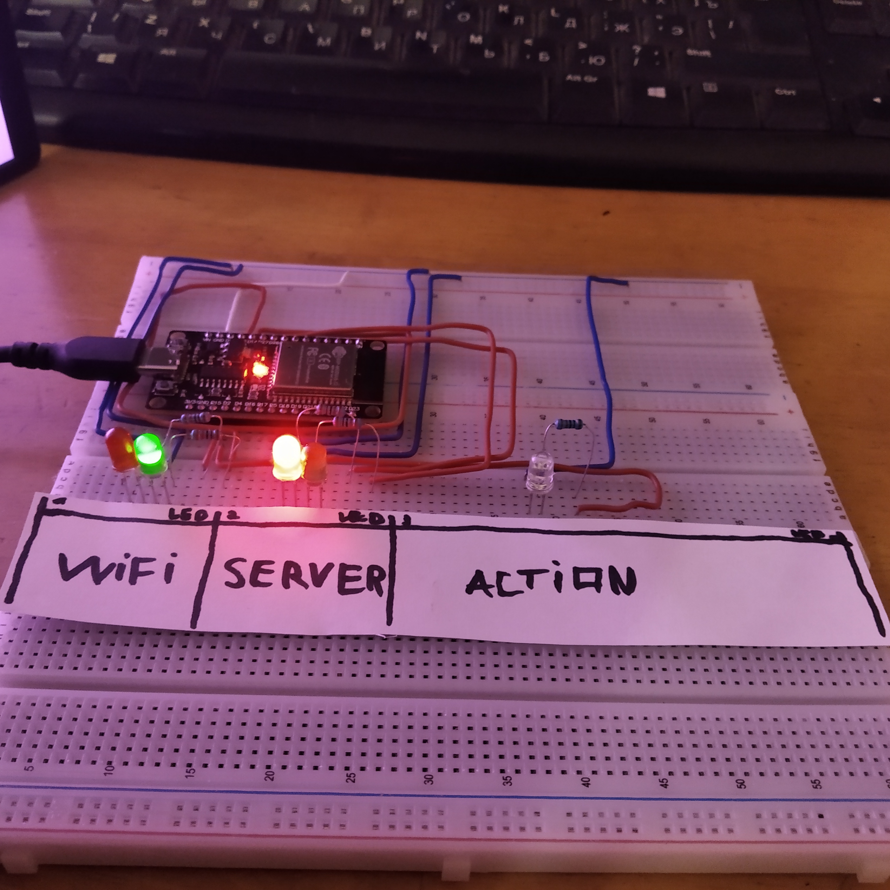
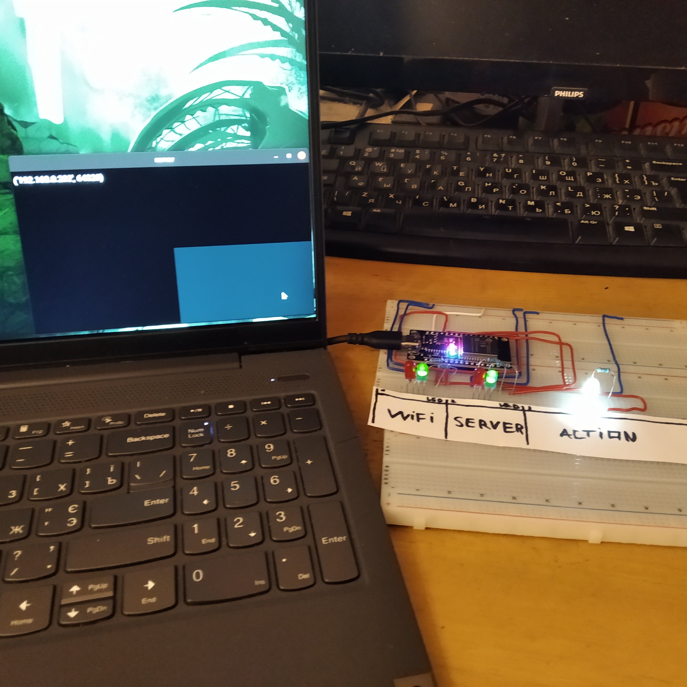
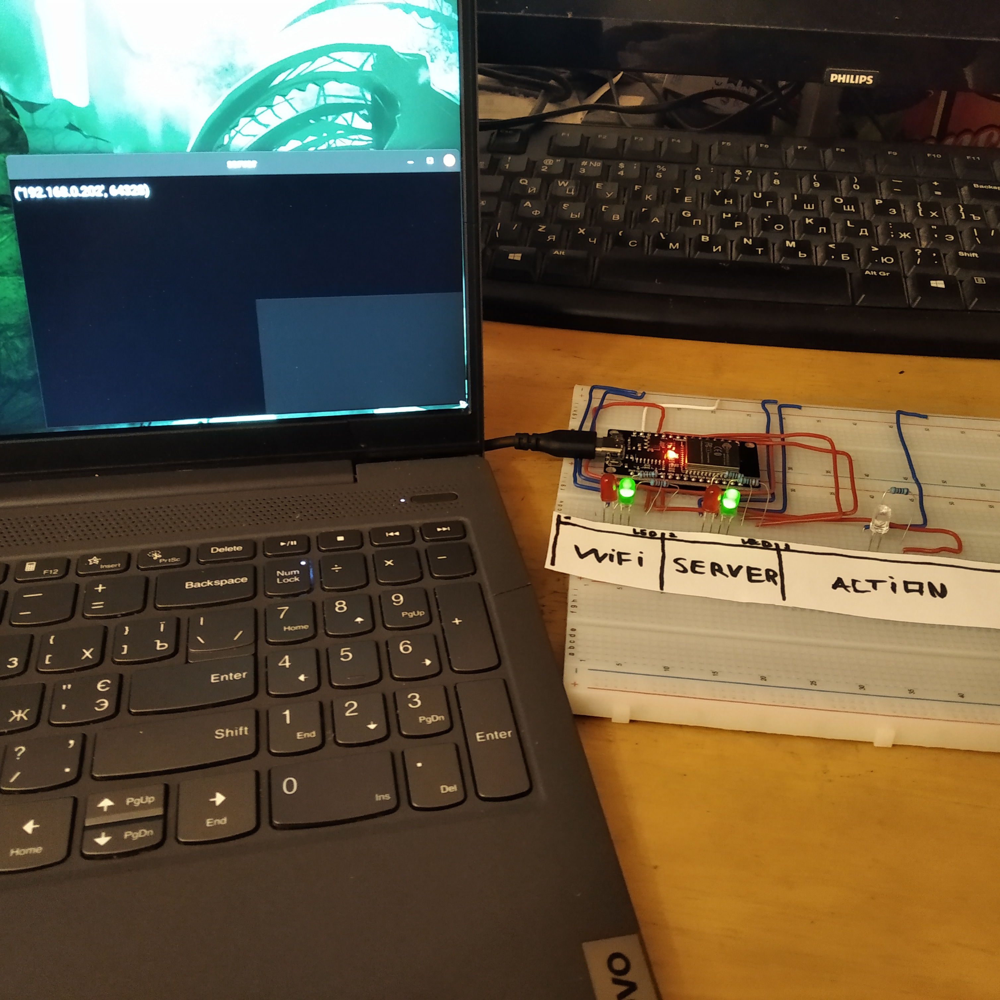
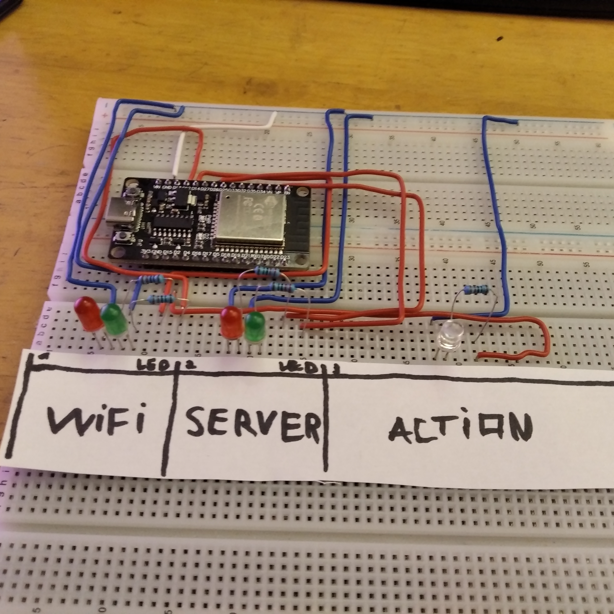

# ESP32 WIFI + SERVER CONNECTION



## 🤨 Навіщо ?:
просто цікавий проект, для навчання основам micropython і роботи із мережею.

## 🤓 Опис:
це простий тест на працездатність ESP32 із мережею. щоб перевірити чи працює WIFI чіп і який PING між платою ESP32 і ПК. таккож ідеально для для навчання основам micropython і це готова база щоб робити проекти із мережею.

## ☠️ Використані технології:
- прошивка на MICROPYTHON
- складання схеми на макетній платі

## 🌱 Структура проекта:
- `screenshots/` — фотографії проекта
- `server.py` — головний файл сервера на пк
- `main.py` — головний файл прошивки

## 😇 Фічі:
- світиться червоний LED в секції "WIFI" - плата не пдключена до WIFI
- світиться зелений LED в секції "WIFI" - плата пдключена до WIFI
- світиться червоний LED в секції "SERVER" - плата не пдключена до сервера (пк)
- світиться зелений LED в секції "SERVER" - плата пдключена до сервера (пк)
- при натисканні кнопки на сервері (або будь якої кнопки на клавіатурі пк) - LED в секції "ACTION" буде світитись білим весь час поки кнопка натиснута і LED вимикається коли кнопку відпущено

## 🌚 Компоненти які потрібні для збірки:
- ESP32-WROOM (1x)
- макетні плати (1х-3х)
- червоний світлодіод (2х)
- зелений світлодіод (2х)
- білий світлодіод (1х)
- резистори 220 ом (5х)
- дроти

## ⚠️ ПОПЕРЕДЖЕННЯ:
- якщо ви захочете назначити свої номери пінів, то ось вам список БЕЗПЕЧНИХ ДЛЯ ВИКОРИСТАННЯ пінів:
- 2, 4, 5, 12, 13, 14, 15, 16, 17, 18, 19, 21, 22, 23, 25, 26, 27, 32, 33
- ці піни універсальні і безпечні для загального користування.


## 😎 Як це запустити ?:
1. встановлюємо необхідні пакети на пк/ноутбук
```bash
sudo apt update
sudo apt install python3
sudo apt install python3-pip python3-dev libsdl2-dev libsdl2-image-dev libsdl2-mixer-dev libsdl2-ttf-dev libportmidi-dev libswscale-dev libavformat-dev libavcodec-dev zlib1g-dev libgstreamer1.0-0 gstreamer1.0-plugins-base gstreamer1.0-plugins-good
pip install "kivy[base]"
sudo pip3 install adafruit-ampy
```
2. змінюємо ці рядки на ваші дані в файлі `main.py`
```python
wifi_ssid = "SSID" # ВАШЕ ІМЯ ВАЙФАЯ
wifi_pwd = "PSSWORD" # ВАШ ПАРОЛЬ ВІД ВАЙФАЯ
ip_of_computer = '192.168.0.XXXX' # айпі адреса сервера (НЕ ЛОКАЛХОСТ)
```
3. заисуємо прошивку на ESP32
```bash
ampy --port /dev/ttyUSB0 put main.py
```
4. запускаємо сервер на пк
```bash
python3 server.py
```

## ✨ А ось так це все виглядає в реальному житті





